## 3. Workbench Dashboard
The purpose of Workbench Dashboard is two-fold:
1. To employ interactive visualization to help Workbench users identify and understand the relationships among simulation artifacts easily, and potentially help the analysis of simulation results.
2. To enable the creation of new simulations from the artifacts of previous simulations, letting previous experimentation guide future experiments. 

### 3.1. Running Workbench Dashboard

#### 3.1.1. Maven
Compile and build the project using the following command.
```shell
mvn install
```

#### 3.1.2. Java IDEs
1. Run the main class **edu.uwb.braingrid.workbench.provvisualizer.ProvenanceVisualizer** directly.

### 3.2. Visualizations and interactions
#### 3.2.1. Visualizations
1. The initail UI looks like this. Click the "Import Provenance" button to visualize the universal provenance file generated by Workbench.
Note that you will need to run a simulation before this file contains provenance. Alternatively, you can choose a provenance file to view by clicking the "Choose Provenance" button.
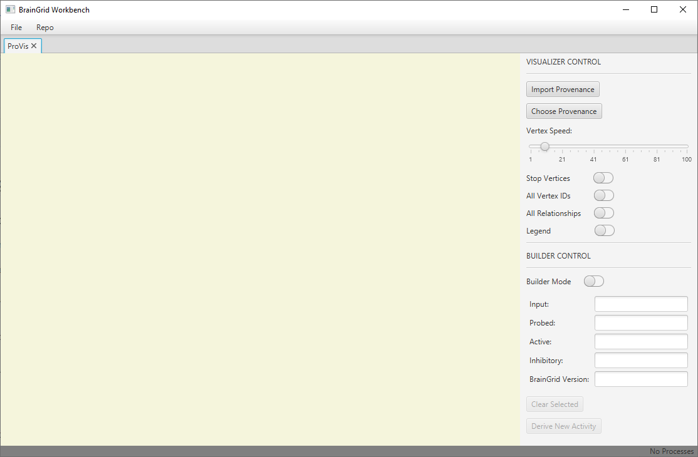

2. The provenance file should be a Turtle File (.ttl) with [PROV-O standard](https://www.w3.org/TR/2013/REC-prov-o-20130430/). The generated provenance files for each individual simulation can be found in /WorkbenchProject/target/projects/NameOfSimulation/provenance/NameOfSimulation.ttl 


3. The visualization may looks similar to the screen dump below. It is a node-link diagram. To check the meanings of the nodes, display the legend by using the "Legend" toggle button at the right side.
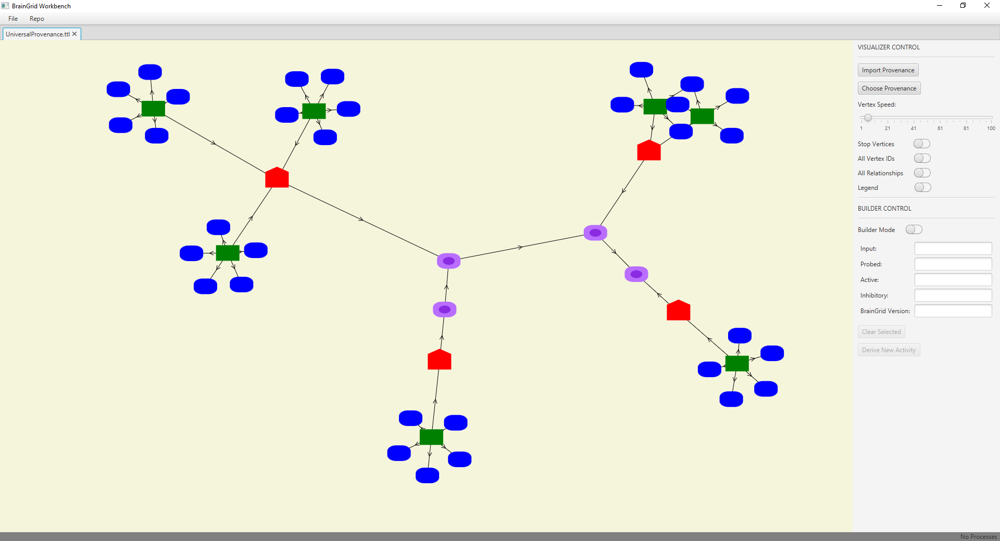

#### 3.2.2. Show a legend
1. The Legend explains the meaning of each node.
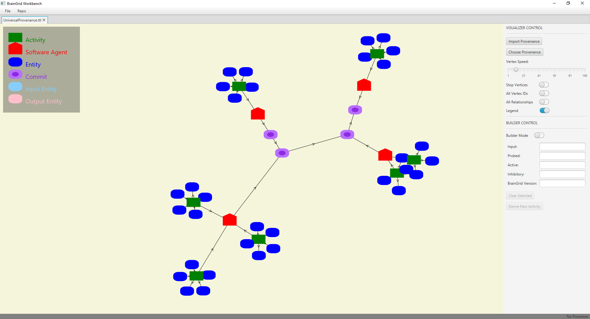

#### 3.2.3. Show labels
1. Move a mouse on a node or a edge to display the label of the node or edge. Click on the node or edge to keep showing the label. Double click anywhere on the screen to deselect all nodes and edges.
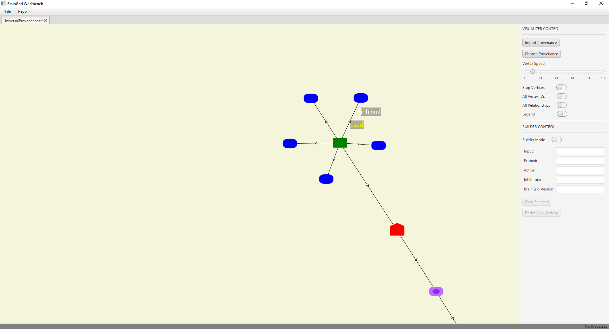

#### 3.2.4. Move nodes around
1. Use the "Stop Vertices" toggle button to disenble automatic node distribution. Then, users can move nodes freely.


#### 3.2.5. Highlighting an activity node and its related nodes
1. If a mouse is on an activity node, the activity node and its related nodes is enlarged. Also, the edge color change to green. It is used to highlight significant information related to the activity.
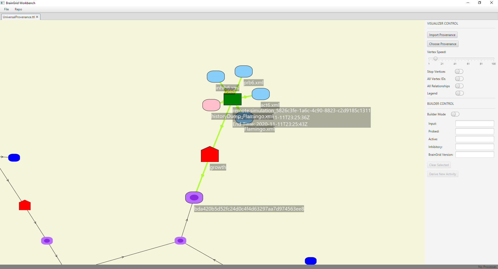

#### 3.2.6. Comparing two artifacts
1. Drag one node to another node until the other node change to yellow.


2. After releasing the left mouse button, a side-by-side text view window is displayed. Green lines indicate changed lines. Red lines indicate added lines. Grey lines indicate deleted lines.


### 3.3. Dashboard Builder

#### 3.3.1. Enable Builder Mode
1. From the "Builder Control" Panel to the right-hand side, toggle "Builder Mode" on.
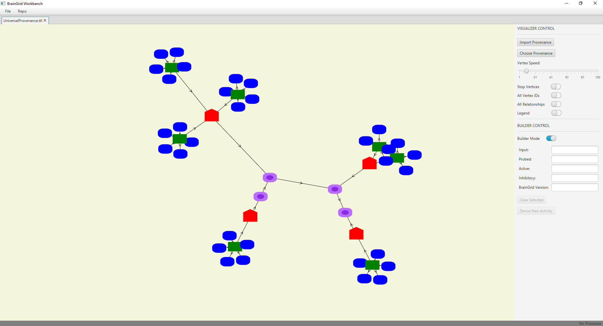

#### 3.3.2 Select components of previous activities to build derive a new activity
1. Input files, including the simulation input file and the 3 types of layout files, and BrainGrid commits can be selected by clicking on the nodes you wish to use as presets.
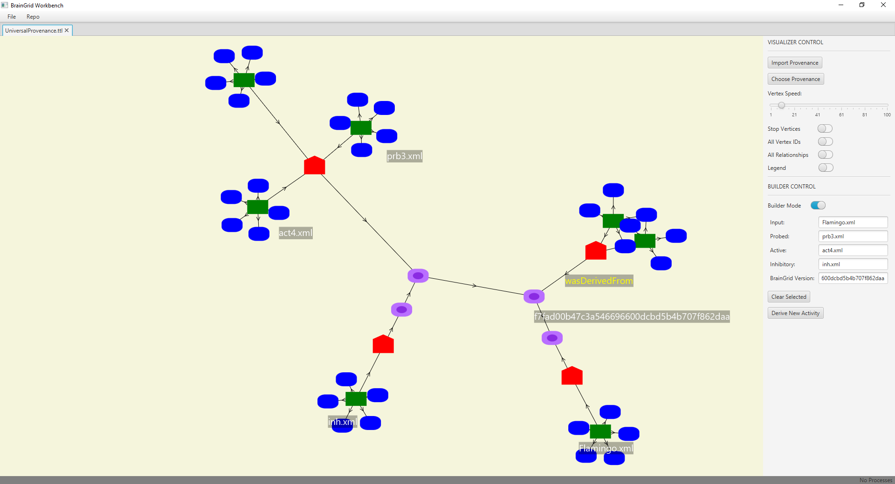

2. In the example above, each of the selected presets came from a different activity and all presets have been selected. 
* Note that we can derive a new activity with as few presets as desired. 
* Note that we can change a selected preset by clicking on another node of the same type. 
* Clicking "Clear Selected" will deselect all the selected preset. 
* When you are ready to derive a new activity, click "Derive New Activity". This will prompt you to provide a name for the derived activity.
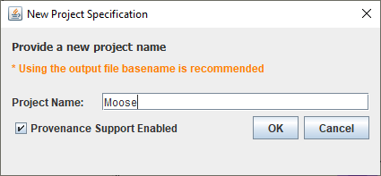

3. After entering a name for the simulation, click "OK". The Parameter Class Specification Dialog will appear next, click "OK"
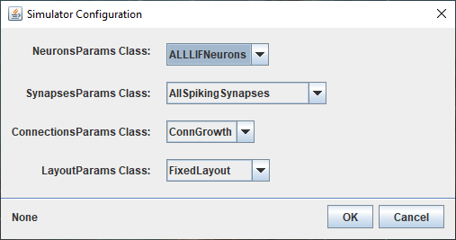

4. The Simulation Configuration dialog will open next. Note that we see the input parameters have been preset from the values provided by the selected simulation input. 
* Note that the "Message:" field above the "Build" button displays "Good!". This is because we have provided presets for the Layout Parameters, which have been automatically imported into the project for us.
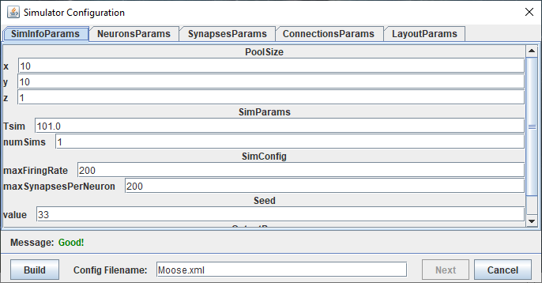

5. Click on the "LayoutParams" tab to observe the Layout Parameters that have been imported as presets. 
* Note that in this example, we have provided all 3 inputs as presets. If one does not provide a preset for a Layout Parameter, one needs to import a file for that parameter at this time. 
* After ensuring that we have made any adjustments to the SimInfoParams we desire and have imported any LayoutParams that have not been preset, click "Build". 
* The "Message:" field will be updated to show "successfully persisted..." if the build was successful. Click the "Next" button.
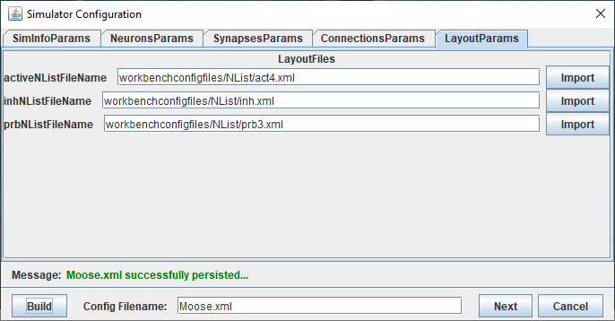

6. After clicking "Next", the Script Specification dialog will appear as shown below. Note that the SHA1 Checkout Key has been preset, with both "Pull" and "Build" selected. 
*To ensure we do not interfere with previous projects, provide a unique "Simulation Folder Location". After doing so, click the "Run" button to execute the simulation.
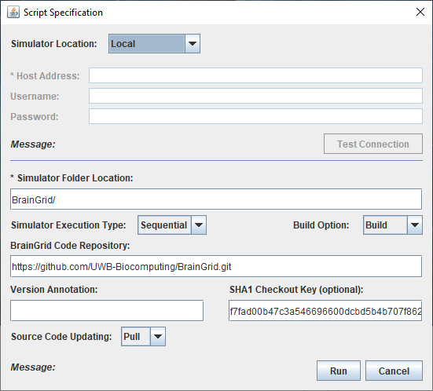

7. The Runtime Environment Window will pop-up after clicking "Run". Provide the simulation enough time to complete, then click the analyze button. If you see output matching what is shown below, you have successful collected the project's provenance.
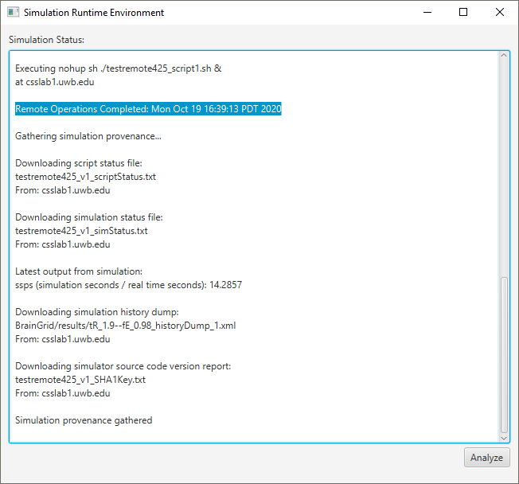

8. Close the Runtime Environment Window and click the "Import Provenance" button to reload the universal provenance and see your new project as it relates to all other activities.


### 3.4. Technologies and third party libraries
The following technologies and libraries were used to build Workbench Dashboard.
* [Java 8](https://docs.oracle.com/javase/8/docs/)
* [JavaFX](https://docs.oracle.com/javase/8/javafx/get-started-tutorial/jfx-overview.htm#JFXST784)
* [JGit](https://www.eclipse.org/jgit/documentation/)
* [RichTextFX](https://github.com/FXMisc/RichTextFX)
* [ControlsFX](http://fxexperience.com/controlsfx/)
* [DiffUtils](https://code.google.com/archive/p/java-diff-utils/)
