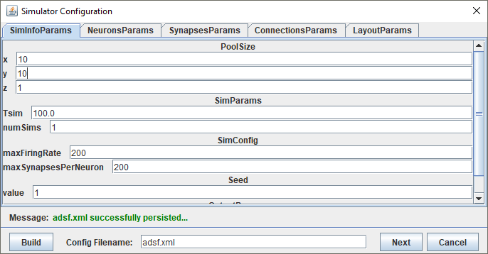
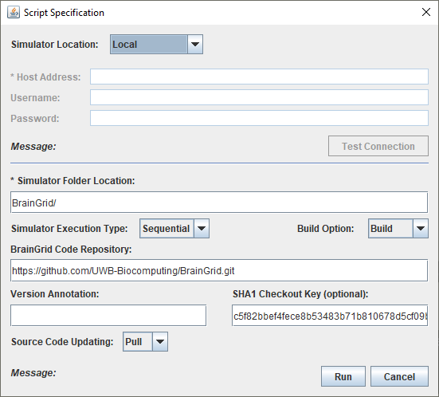
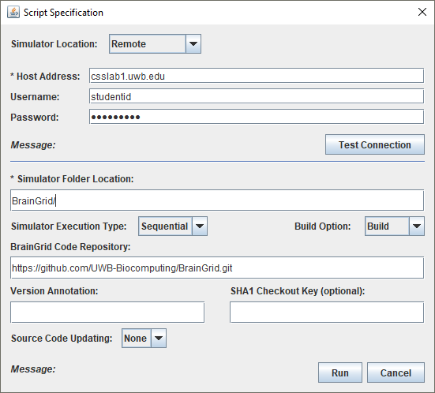

## 2. Running Simulations
### 2.1. The workflow
 
* If the Workbench is started successfully, a new window as shown in the below screen dump will be displayed.

* Create a new simulation project. Choose File - > New - > Simulation Starter.

* Enter the project name and press the “OK” button.

 
* A new window to setup the parameters classes is displayed. After choosing the parameters classes, press the “OK” button.

 
* Depending on the parameters classes selected, the corresponding parameters are displayed with their default values for user to set. Use the “Import” button in the “LayoutParams” tab to import layout files, if necessary. After setting all the parameter values, press the “Build” button to generate the config file for the simulation.

 
* If the config file is generated successfully, press the "Next" button to close the window.

 
* Setup the parameters for script generation. The “SHA1 Checkout Key” is the commit number. If it is blank, it will checkout the latest version. Make sure to specify the Simulation Folder Location. 

 
* Click the “Run” button to run the script. If the simulator location is a remote location, it transfers the configuration, neuron list and the script files to the remote machine before running the script on the remote machine.

 
* Before sending files to remote machine, enter the username and password to establish connection to the remote machine.

* The Simulation Runtime Window is displayed. The simulation will need time to run on the local or remote machine before completing. Give the simulation a few minutes to run to completion.

 
* Press the “Analyze” button to download simulation results after the completion of the simulation.

 
* The execution time of the simulation depends on various factors, such as the configuration file, the available resources on the remote machine. So, if the simulation is not completed or unexpected errors occur during the execution, a message will be displayed to indicate that the download of execution result failed. Then, users need to investigate on the remote machine to find out the root cause.
 

### 2.2. About the generated script files
The generated script files do the following steps.
1. Make an empty directory and clone the BrainGrid repository.
2. Checkout the revision specified in SHA1 field of the script configuration dialog.
3. Execute "make -clean" to remove any existing binary files from the repository directory.
4. Execute "make" to build the simulator.
5. Run the simulation by calling the simulator with the corresponding parameters.
